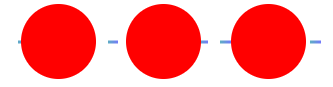
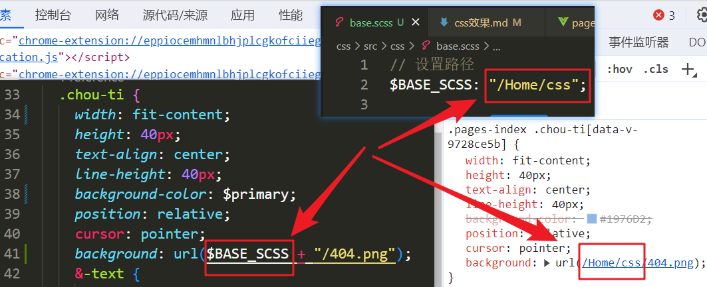

<!--
 * @Description: 
 * @Date: 2023-09-20 21:54:02
 * @FilePath: \web-project\css\css效果.md
-->


##### 利用 **i** 标签加background-image设置虚线 取代 border: dashed

```css
.border-i {
    background-image: repeating-linear-gradient(90deg,#0000,#0000 8px,#ffca98cc 0,#ffca98cc 15px,#0000 0);
    display: block;
    height: 1px;
    left: 0;
    position: absolute;
    top: 75px;
    width: 100%;
}
```
##### Scss设置变量 , 全局路径变量


```
如果在 Vue 单文件组件的 <style> 标签上使用了 scoped 属性，全局的 SCSS 变量在该组件内将不可用

1. 通过vite.config.js中配置css
2. 局部引入scss:  @import "src/css/base.scss";
```