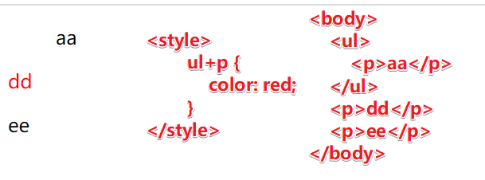
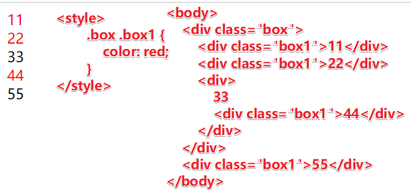
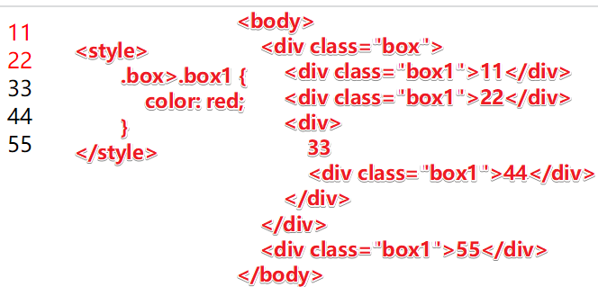
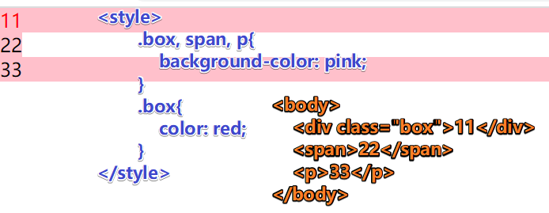

加号+  邻近元素选择器：只会选中紧接在另一个元素后的元素


空格 ：选择所有后代元素


尖括号> ：选择所有子元素。



,  分组选择器 ： 当多个对象定义了相同的样式时，就可以把它们分成一组


:first-child  选择第一个元素； :last-child 选择最后一个元素
```
ul li:first-child{ 
     color: #0dd2f5; 
}
ul li:last-child{ 
    color: #0dd2f5; 
}
<ul> 
   <li>1</li>   <!-- :first-child 选中的元素 --> 
   <li>2</li> 
   <li>3</li>   <!-- :last-child 选中的元素 -->
</ul>
```
:nth-child(2) 选中第 n 个子元素  ; :nth-child(odd) 选中even 偶数 ,odd 奇数
```
ul li:nth-child(2) {
    color: #0ec2c9;
}
ul li:nth-child(odd) { 
    color: #0ec2c9; 
}

<ul> 
    <li>1</li>   <!-- :nth-child(odd)选中的元素 --> 
    <li>2</li>   <!-- :nth-child(2)选中的元素 --> 
    <li>3</li>   <!-- :nth-child(odd)选中的元素 -->
    <li>4</li> 
</ul>
```
:nth-child(n)   选择父元素里面的第n个子元素,不管里面子元素的类型, 权重为10
```
注意：:nth-child(n) 选择父元素里面的第n个子元素，不管里面子元素的类型
/* :nth-child(n)   匹配父元素中的第 n 个子元素e  
        even 偶数 ，odd 奇数 
        n 是公式 但是n 从0开始计算, 超出0个则被忽略 
        2n 即偶数 ，2n+1 即奇数 
        5n 即 5/10/15 
        n+5 从第5个开始(包含第五个)到最后 
        -n+5 前5个(包含第5个) 
*/

div :nth-child(n) {   /* n 表示选中所有元素 */ 
    color: #0ec2c9; 
}
div span:nth-child(2n) {    /* 选中所有偶数元素,即2、4 */ 
    color: #0ec2c9; 
}
div:nth-child(n+2) {    /* 选中从第2个开始到最后的元素 */ 
    color: #0ec2c9; 
}

<div> 
    <p>我是第一</p> 
    <span>我是第二</span> 
    <span>我是第三</span> 
    <span>我是第四</span> 
</div>
```
:nth-of-type(n)  选择父元素里面指定类型的元素第n个子元素, 权重为10
```
div span:first-of-type {    /* 选择span的第一个元素, 即"我是第二" */
     color: #0ec2c9;
}
div span:last-of-type{    /* 选择span的最后一个元素, 即"我是第四" */ 
     color: #0ec2c9; 
}
div span:nth-of-type(n) {   /* n表示选中所有span元素" */ 
     color: #0ec2c9; 
}

<div> 
   <p>我是第一</p> 
   <span>我是第二</span> 
   <span>我是第三</span> 
   <span>我是第四</span> 
</div>
```
input[type="search"]   选择属性值等于search的元素
```
input[type="search"] {
     color: #0099ff;
 }
<!-- 都选中 -->
<input type="search" name="" id="" value="搜索框"> 
<input type="search" name="" id="" placeholder="搜索框">
```
div[class^="icon"]   ^选择属性值以icon开头的元素
```
div[class^="icon"] { 
   color: #0099ff; 
}
<!-- 都选中 -->
<div class="icon1">图标1</div> 
<div class="icon2">图标2</div>
```
div[class$="icon"]  $选择属性值以icon结尾的元素
```
div[class$="icon"] { 
     color: #0099ff; 
}

<div class="icon1">图标1</div> 
<div class="absicon">abs图标</div>   <!-- 被选中的元素 -->
```
div[class*="icon"]  *选择属性值中包含icon元素都被选中
```
div[class*="icon"] { 
     color: #0099ff; 
}
<!-- 都选中 -->
<div class="icon1">图标1</div> 
<div class="absicon">abs图标</div>
```
button[disabled]     选中disabled元素
```
button[disabled]{
   /* cursor: default; */
   cursor: pointer;
}

<button disabled="disabled">禁用按钮</button>
```
::before ::after伪元素选择器 
```
/* 
::before 在元素内部的前面插入内容 
::after 在元素内部的后面插入内容 
注意：before和after 必须要有 content 属性 
before和after创建一个元素，属于行内元素，因为在DOM里看不见，所以称之为伪元素，权重为1 
*/

div{ 
    width: 100px; 
    height: 100px; 
    background-color: pink;  
} 
div::before{ 
    content: '\ea50'; 
    width: 50px; 
    height: 50px; 
    background-color: red; 
    display: inline-block; 
}

<div> 
    <span>我是</span> 
</div>
```
