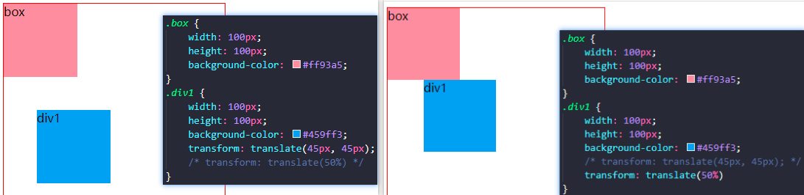
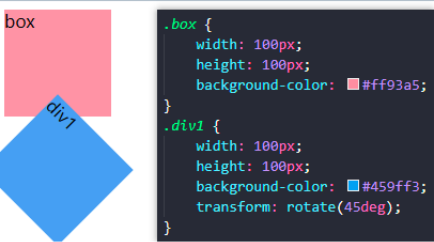
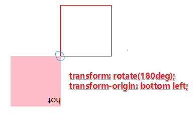
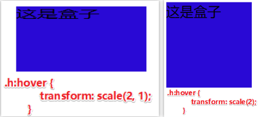
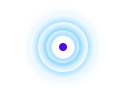

  1、过渡 transition 
  2、2D转换transform: rotate(45deg) translate(100px, 0px) scale(1.5, 1.5)；
  3、3D转换
  4、动画 @keyframes


1、过渡 transition **谁做过渡给谁加**

```
transition: 要过度的属性 花费时间 运动曲线 何时开始;
属性：想要变化的css属性，宽度高度 背景颜色 内外边距都可以，如果所有属性写一个all就可以
花费时间：单位是秒(必须写单位) 比如 0.5s
运动曲线：默认是ease(可以省略)
何时开始：单位是秒(必须写单位)可以设置延时触发时间 默认是0s(可以省略)

示例1：transition: width .5s ease 1s;
示例2：(多个属性用，) transition: width .5s ease 1s,height .5s ease 1s;
示例3：(简写) transition: all 0.5s;
```

2、2D转换

transform 属性向元素应用从2D 或3D转换。该属性允许我们对元素进行旋转、缩放、移动或者倾斜。注意：对行内元素无效
```
transform：
    translate：移动(平移) 
    rotate：旋转，单位是度（deg°） 
    scale：缩放
transform-origin：选择旋转和缩放的起点
综合转换连写格式：transform: rotate(45deg) translate(100px, 0px) scale(1.5, 1.5);
```
transform: translate(100px, 0px);第一个参数:水平方向，第二个参数:垂直方向。
transform: translate(50%,50%); 参数可用%,移动的距离是盒子自身的宽度和高度来对比 (这里50%就是50px,因为盒子的宽度是100px)



transform: rotate(45deg);   其中deg是单位,代表多少度,是允许负值的


transform-origin:bottom left 转换起点是应用转换的点,转换原点是旋转中心

transform: scale(0.5,1.5)   如果取值是1代表不变,取值小于1缩小,等比例缩放可简写成一个值



3、3D转换

```
3D位移：transform: translate3d(x, y, z);
3D旋转：rotate3d(x,y,z);
透视：perspective:400px;    // 透视写到被观察元素的父盒子上面
3D呈现：transform-style:preserve-3d;    // 让盒子保留立体空间,给父级添加

```


4、动画 @keyframes

```
1、定义动画
@keyframes 动画名称 { 
      0% { width:100px; }
      50%{ width:250px; } 
      100% { width:500px; } 
}
2、使用动画
div{
    animation-name: 动画名称;   //(必须) 使用动画名称
    animation-duration: 3s;    //（必须）持续时间，默认0
    animation-delay: 2s;       // 动画何时开始, 默认0
    animation-iteration-count: infinite;  // 动画播放次数，默认1，无限infinite
    animation-direction: normal; // 是否反方向播放，默认normal，反方向alternate
    animation-fill-mode: backwards;  // 动画结束后停留位置，默认backwards回到起始位置                                        forwards停留在结束位置
  animation-timing-function:ease;//速度变化,默认ease不是匀速的,而是逐渐放慢;
                                    linear:匀速;steps(5)指定时间函数间隔数量(步长)
    animation-play-state: paused;  //鼠标经过(:hover)让这个div停止动画，离开就继续动画
}

连写格式：animation: move 3s forwards;
animation: 动画名称 持续时间 运动曲线 何时开始 播放次数 是否反方向 动画起始状态和结束状态;
多个动画用,分隔：animation: move 1s steps(7) infinite, bear 3s forwards; 
```

案例：热点图
```
        .city { 
            position: relative; 
            top: 200px; 
            left: 200px; 
            width: 50px; 
            height: 50px; 
        } 
        .city .dott { 
            position: absolute; 
            top: 42%; 
            left: 42%; 
            width: 8px; 
            height: 8px; 
            border-radius: 50%; 
            background-color: rgb(80, 12, 240); 
        } 
        .city div[class^="pulse"] { 
            position: absolute; 
            top: 50%; 
            left: 50%; 
            transform: translate(-50%, -50%); 
            width: 10px; 
            height: 10px; 
            box-shadow: 0 0 12px #009dfd; 
            border-radius: 50%; 
            animation: pulse 1.2s linear infinite; 
        } 
        .city div.pulse2 { 
            animation-delay: .4s; 
        } 
        .city div.pulse3 { 
            animation-delay: .6s; 
        } 
        .city div.pulse4 { 
            animation-delay: .9s; 
        } 
        @keyframes pulse { 
            0% {} 
            70% { 
                width: 40px; 
                height: 40px; 
                opacity: 1; 
            } 
            100% { 
                width: 70px; 
                height: 70px; 
                opacity: 0; 
            } 
        }

<div class="city"> 
   <div class="dott"></div> 
   <div class="pulse1"></div> 
   <div class="pulse2"></div> 
   <div class="pulse3"></div> 
   <div class="pulse4"></div> 
</div>
```
效果图


