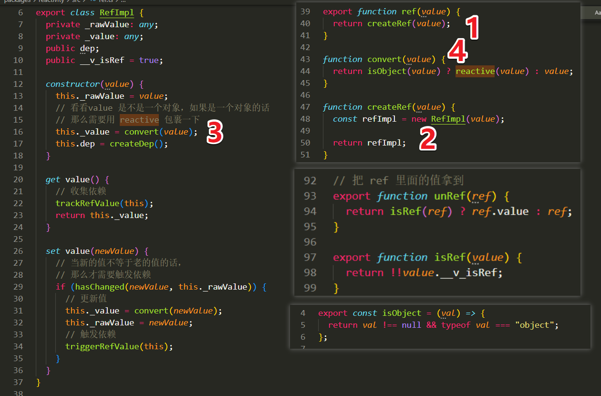
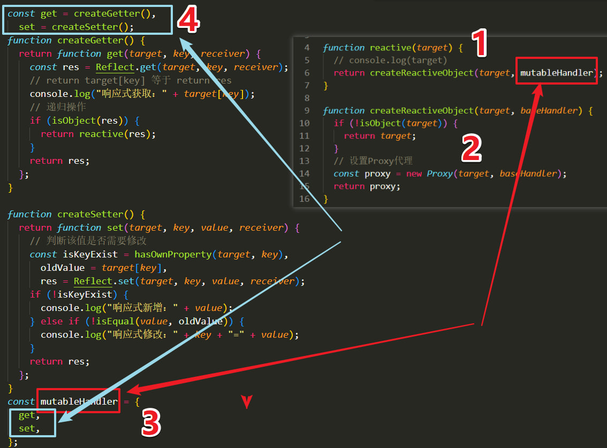

##### Vue2和Vue3的区别

```
vue2: Object.defineProperty()
弊端:  1.对象直接新添加的属性或删除已有属性，界面不会自动更新，需要使用Vue.set()
	  2.直接通过下标替换元素或更新length，界面也不会自动更新

vue3: 代理new Proxy() / 反射Reflect.get()
proxy: 拦截对data任意属性的任意操作，包括属性值的读写，属性的添加，属性的删除等
Reflect: 动态对被代理对象的相应属性进行特定的操作
弊端:有兼容性问题的，IE完全不支持


vue2示例: 数组响应式会丢失
let vm = new Vue({
    data: {
        items: [1,2,3]
    }
})
vm.items[0] = 3; // item[0]将失去响应式
vm.length = 5; // vm.length将失去响应式

vue3示例: 数组响应式保持
const state = reactive({
  arr: [1, 2],
})
function increment() {
  state.arr[0]++; // 修改数组第一个元素：
  state.arr.length++; // 数组长度递增：
}
```

##### reactive() 与 ref()

````
reactive(): 仅适合对象类型的数据，例如对象、数组、Map、Set，不适用string、number、boolean等基础类型
ref(): 可以创建任意类型的响应式对象
使用ref()的好处：
-可以响应式的替换.value的值，并且替换后会保持响应式
-可以接收任意类型的值
-可以解构赋值，也可以直接使用.value的值作为函数的参数，这些都是保持响应式的
ref()会包装一个.value属性，因此在使用时可能会存在解包的情况：
-在模板中解包：如果作为顶层属性被访问时，可以不加.value，否则需要添加
-在响应式对象中解包：作为响应式对象的属性，.value会自动解包。需要注意，如果是数组、Map等集合类型的响应式对象中，访问元素时.value不会自动解包

总结:
Vue3使用Proxy实现响应式，无需像Vue2遍历原数据对象的每一个属性，可以更加高效的实现响应式。
Vue3中需要自己根据需要声明响应式对象，一般使用reactive()和ref()
reactive()多用于创建数组、对象等响应式对象，并且在之后的使用中不会发生替换、解构、属性值作为函数参数等情况
ref()可适用于任意类型，相当于是重新封装了一个对象，在替换、解构、属性值作为参数时都能保持响应式。
ref建议用于基础数据类型的响应式声明，如果是声明一个数组或对象，实际上会调用reactive将其转换为Proxy，并赋值给.value

reactive(): 示例
let state = reactive({count: 0})
let num = state.count; // num不具有响应式，其修改不会影响state.count
let {count} = state; // count也不具有响应式，其修改不会影响state.count

ref(): 示例
import {ref} from 'vue'
let num = ref(0) // 等价于{value: 0}
let str = ref('') // 等价于{value: ''}
let bool = ref(false) // 等价于{value: false}
````

##### props的默认值是对象Object或数组Array,默认值为什么是一个函数?

```
当默认值是对象或者数组时,必须从一个工厂函数返回.
默认值不是必须的,当需要设置默认值时使用.

default: () => []
default: () => ({})
参考:https://developer.mozilla.org/zh-CN/docs/Web/JavaScript/Reference/Functions/Arrow_functions#%E8%BF%94%E5%9B%9E%E5%AF%B9%E8%B1%A1%E5%AD%97%E9%9D%A2%E9%87%8F
```

##### vue3源码解析
###### ref


###### reactive
